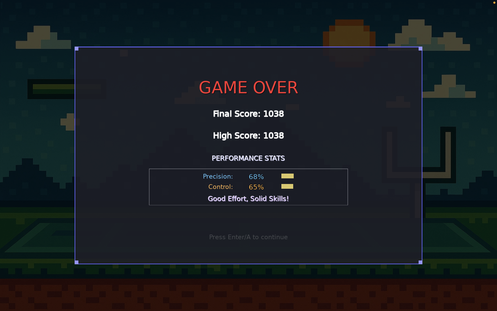
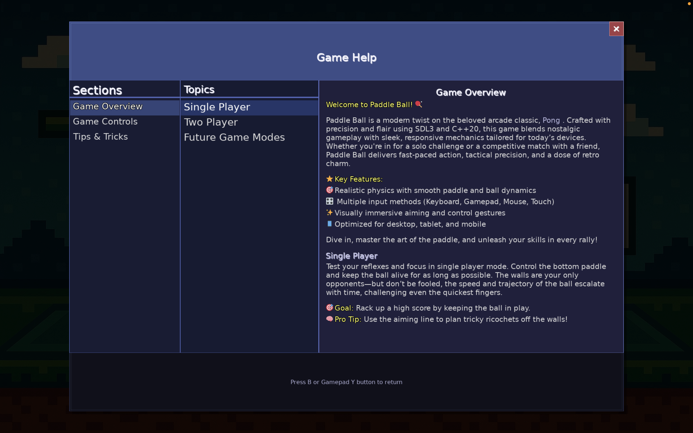

# 🎮 Retro Paddle Ball

A retro-style, multi-platform paddle ball game built in my spare time using **C++20** and **SDL3**, inspired by my kids and childhood memories.

> _"This is more than just a game—it's a story about passion, learning, and leadership in the age of AI. Made with love, family inspiration, and spare-time engineering."_

---

## 🕹️ About the Game

**Retro Paddle Ball** brings the timeless fun of paddle-and-ball mechanics into a sleek and modern engine.

This is a personal project that started when my kids asked:
> *"Can you build a game like the ones we play on RetroArch?"*

This project began as a fun challenge: could I build a retro-style paddle ball game that my kids would love to play, while balancing a demanding professional life? As an engineering leader who spent most of my time managing teams, I missed being in the trenches and creating something end-to-end for a little while. This game gave me the perfect excuse.

Encouraged by my kids, who regularly play on RetroArch, I built this cross-platform game in C++20 using SDL3. It supports keyboard, touch, gamepads, and mouse input across:
- 🖥️ macOS (Intel & Apple Silicon)
- 🪟 Windows
- 📱 Android 6.0+(phones, tablets, TVs)
- 🕹️ Supports keyboard, mouse, gamepad, and touch

My goal: to demonstrate that it's possible to build something meaningful, fun, and technically robust—even with limited time—while staying curious and humble.

The result: a journey through graphics, physics, audio, input handling, resolution scaling, multi-platform deployment, machine learning & AI, and computer networking.

---

## 🕹️ Features

- 🟠 Smooth ball physics and collision logic
- 🎮 Multi-Input Support: Keyboard, mouse, touch, gamepad
- 📺 Multi-Display Support: Plays well on 6" phones, 80" TVs, tablets, and desktops. Resolution-agnostic layout (phones to 80" TVs). Multi-display support.
- 🧠 Game Modes: Single Player & Two Player (More coming soon)
- 📦 Cross-Platform: Built and tested on:
  - macOS (Intel + Apple Silicon)
  - Windows
  - Android (phones, tablets, TVs)
  - iOS (iPhone and iPad - in progress)
  - Web (WASM – in progress)
- 🔊 Sound effects and retro-themed visuals
- 📜 In-game Help, Settings, and Score display

---

## 🔮 Future Plans

While the current version is fully playable, I have several exciting features and improvements I'd love to explore as time permits.

### 🎮 Gameplay Features
- AI Paddle with adjustable difficulty (trained on real human play data)
- Home network multiplayer over Wi-Fi
- Power-ups & game modes (e.g. survival, timed challenges)
- In-game settings (custom paddles, difficulty, sound, etc.)
- Dynamic objects like bricks and collectibles for extra points

### 🧠 Technical Enhancements
- Enhanced physics and edge collision precision
- Game state saving and resuming
- Smart layout engine for adaptive UI across devices

### 🖥️ Platform Expansion
- iOS (via SDL3 + Metal backend)
- Web (via WebAssembly – builds successfully but needs polish)

### 🧪 Engineering Deep Dives (via blog posts)
- Frame rate–independent physics
- Input abstraction across devices
- Designing for both 6” phones and 80” TVs with a unified HUD engine
- Lessons in perseverance, ambiguity, and solo-shipping

> 💬 Timelines depend on spare time and complexity—but I'm excited to keep growing this.

---

## 📸 Screenshots
Here’s a preview of Retro Paddle Ball in action:

---

## 📥 Downloads

Download the latest version from the [Releases page](https://github.com/stanlymt/retro-paddle-ball/releases).

---

## 🎛️ Controls

| Input Type | Control Scheme              |
|------------|------------------------------|
| Keyboard   | Arrow keys or `<(,)` and `>(.)` |
| Gamepad    | D-Pad / Left Analog Stick    |
| Touch      | Drag paddle directly         |
| Mouse      | Move paddle horizontally     |

## 🙋 FAQ
**Why paddle ball?**  
Because it's simple, nostalgic, and just enough of a challenge to build well across platforms.

**Can I contribute or suggest features?**  
Absolutely. Use the Discussions tab or raise an issue. Feature suggestions from kids get bonus points!

**Are you switching to gaming professionally?**  
No—this is a passion project. I love the gaming domain (I wrote DOS games as a teenager), but have no plans to pursue it full-time. My main focus remains engineering leadership.

**Are you returning to an IC/technical role?**  
Not exactly. I’m deeply committed to engineering leadership, but staying hands-on sharpens my empathy and leadership judgment. I enjoy hands-on work, but my passion lies in leading teams, driving results, and developing people.

**Are you making the source code open?**  
Not right now. I’ve poured countless hours into building this project, often late at night or on weekends, balancing it alongside family and professional life.

While I fully believe in the spirit of open source, I’m currently choosing to keep the code closed for a few key reasons:
- 🧼 The codebase needs cleanup and refactoring before it represents the kind of quality I want to stand behind publicly.
- 🔒 I want to avoid misuse or misrepresentation of the code, especially while I’m actively iterating on features.
- 🧩 Many gameplay elements are still in flux, and publishing the source now could lead to misunderstandings about the design or quality.

That said, I’m happy to:
- Answer technical questions
- Share learnings through future blog posts
- Possibly open up certain parts of the code later if there’s enough interest and context

For now, I’m prioritizing clarity, completeness, and integrity of the experience—both for players and fellow developers.

**Did you use AI to build this?**  
Yes, I used tools like GitHub Copilot, OpenAI, and sound effect engines. But AI is not a silver bullet. It accelerates parts of the work, but creativity, quality, and engineering decisions still require deep human thought.

---

## 💡 Inspiration & Purpose

This game is a reminder that no matter how busy life gets, we can always create.
- You can stay technical while being an effective leader.
- You can build beautiful things even with limited time.
- Learning never stops
- You can still have fun while being technically serious
- Hobbies can be deeply meaningful, especially when they involve your kids.
  
---

## 📬 Stay Tuned

I'll be sharing technical articles and lessons learned including:

- Multi-resolution game layout design
- SDL3 cross-platform game physics
- Building AI that mimics real players
- Personal growth through creative side projects

---

## 📚 Open Source Libraries Used

- [SDL3](https://github.com/libsdl-org/SDL)
- [SDL3_image](https://github.com/libsdl-org/SDL_image)
- [SDL3_ttf](https://github.com/libsdl-org/SDL_ttf)
- [SDL3_mixer](https://github.com/libsdl-org/SDL_mixer)
- [Google Oboe](https://github.com/google/oboe) – high-performance audio on Android

---

## 📝 License

This project is licensed under the **MIT License**.  
Only precompiled binaries are shared at this time. The source code is not open.

---

Built with ❤️ by Stanly Thomas
[Connect on LinkedIn](https://www.linkedin.com/in/stanlymt/)
